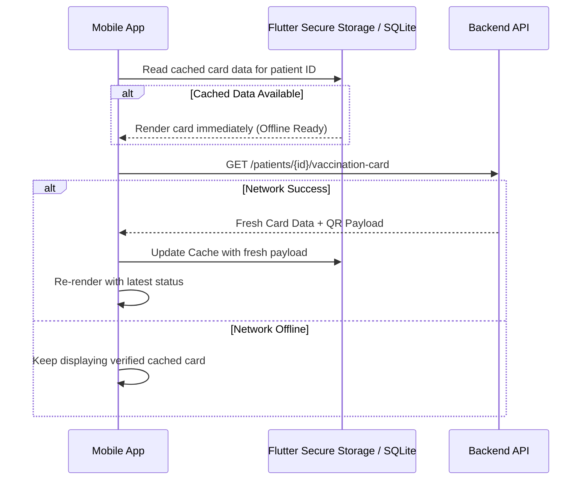

# Digital Vaccination Card System Specifications

This document outlines the complete technical design, verification workflows, offline caching logic, and roadmap for the **Digital Vaccination Card** module in the Animal Bite Management System.

---

## 1. Official Proof & Accreditation Matrix

The Digital Vaccination Card serves as an electronic vaccination passport complying with **DOH (Department of Health Philippines)** and **PhilHealth Animal Bite Treatment Package (ABTP)** standards.

### Data Model Architecture
```
┌─────────────────────────────────────────────────────────────┐
│             Digital Vaccination Card (Mobile/Web)           │
├─────────────────────────────────────────────────────────────┤
│ 1. Clinic & Accreditation Header                            │
│    - Clinic Name (e.g. TAGOLOAN ANIMAL BITE TREATMENT CNTR) │
│    - DOH Accreditation No. (e.g. 2022-10-037)               │
│    - PhilHealth Accreditation No. (e.g. B10034377)          │
│    - Verified Status Badge (ACTIVE / COMPLETED)             │
├─────────────────────────────────────────────────────────────┤
│ 2. Patient Demographics & Bite Exposure                     │
│    - Patient Full Name, Patient ID (P-YYYY-XXXX)            │
│    - PhilHealth PIN & Member Status                         │
│    - Exposure Category (Category I / II / III)              │
│    - Animal Type, Bite Date, and Exposure Place             │
├─────────────────────────────────────────────────────────────┤
│ 3. Scannable QR Code Verification                           │
│    - Signed verification payload:                           │
│      https://[clinic-domain]/verify/card/{card_token}       │
├─────────────────────────────────────────────────────────────┤
│ 4. PEP Dose Schedule Tracker (Day 0, 3, 7, 28 + Boosters)   │
│    - Administered Date & Scheduled Date                     │
│    - Vaccine Generic & Brand (e.g. Speeda PVRV / Rabipur)   │
│    - Lot / Batch Number & Route (Intradermal 0.1mL)         │
│    - Administration Status (Completed, Scheduled, Missed)   │
└─────────────────────────────────────────────────────────────┘
```

---

## 2. Multi-Patient Family Profile Selection Logic

For accounts managing multiple family members (e.g., parents managing dependents/children):

1. **Auto-Detection**:
   - When `showDigitalVaccinationCard(context)` is triggered, the system queries `api.patients()`.
2. **Single Patient Profile**:
   - Directly loads their vaccination card without displaying extraneous switchers.
3. **Multiple Patient Profiles**:
   - Renders a horizontal chip list at the top of the card sheet.
   - Highlights the active profile and displays `(Self)` for primary account holder.
   - Allows instant one-tap switching with dynamic loading and smooth animation.

---

## 3. QR Code & Fast Clinic Triage Scanning

### How Triage / Nurses Verify the Card:
1. Patient presents the Digital Card QR on their mobile device at the clinic reception.
2. Nurse scans the QR using a standard 2D barcode scanner or tablet camera.
3. The system decodes the `card_token` and opens the patient's **Tagoloan Treatment Card (Form 3)** in the Nurse workstation, pre-filling:
   - Patient history and exposure details
   - Next due dose calculation
   - Inventory batch tracking

---

## 4. Offline Caching Strategy (Dead Zone Resilience)

Because clinic waiting areas may have poor cellular connectivity:



---

## 5. Export & PDF Generation Roadmap

1. **Summary Export (Implemented)**:
   - Formatted text export with accreditation numbers, batch numbers, and verification URL for quick sharing via SMS, Viber, or Email.
2. **High-Resolution Image / PDF Generation**:
   - Render printable DOH/PhilHealth official vaccination card layout using `pdf` & `printing` packages.
   - Watermarked with official clinic stamp and signature line for doctor/nurse.
