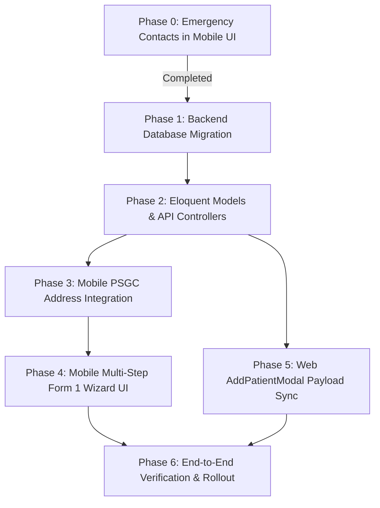

# Form 1 Mobile & Backend Master Implementation Plan

**Created Date**: January 27, 2026  
**Status**: Ready for Execution  
**Target Goal**: Implement complete Form 1 Patient Enrolment (27 fields) across Mobile, Backend, and Web with zero data loss and 100% backward compatibility.

---

## Executive Summary & Background

This master plan unifies the strategies from:
1. [MOBILE_PATIENT_REGISTRATION_FORM1_PLAN.md](file:///c:/xampp/htdocs/abc/animal-bite-management-system/mobile/MOBILE_PATIENT_REGISTRATION_FORM1_PLAN.md) (Mobile UI multi-step wizard, PSGC integration, design system alignment)
2. [BACKEND_SAFE_MIGRATION_PLAN.md](file:///c:/xampp/htdocs/abc/animal-bite-management-system/mobile/BACKEND_SAFE_MIGRATION_PLAN.md) (Backend investigation, schema design, database risk mitigation)

### Key Finding Summary
- **Current State**: Web frontend collects 27 fields, but backend [PatientController.php](file:///c:/xampp/htdocs/abc/animal-bite-management-system/backend/app/Http/Controllers/PatientController.php) and database [patients table](file:///c:/xampp/htdocs/abc/animal-bite-management-system/backend/database/migrations/2026_06_17_160000_create_patients_table.php) only validate and save **12 basic fields**. 15+ fields (blood type, PhilHealth, socioeconomic, PSGC address codes) were being discarded.
- **Phase 0 Status (Completed)**: Emergency contact fields (`emergency_contact_name`, `emergency_contact_number`) have already been safely added to mobile [profile_setup_view.dart](file:///c:/xampp/htdocs/abc/animal-bite-management-system/mobile/lib/views/profile_setup_view.dart) since backend already supported them.
- **Objective**: Create `patient_details` table to persist extended Form 1 data, expand both Mobile and Web API controllers, integrate Philippine Standard Geographic Code (PSGC) API in mobile, and build a 6-step registration wizard UI in Flutter.

---

## Implementation Roadmap Overview



---

## Detailed Phase-by-Phase Execution Plan

### Phase 1: Backend Database Migration (`patient_details` Table)

To prevent cluttering the core `patients` table while ensuring full support for Form 1 extended data, we create a dedicated `patient_details` table.

#### 1.1 Create Migration File
Run artisan command:
```bash
cd backend
php artisan make:migration create_patient_details_table
```

#### 1.2 Migration Code (`backend/database/migrations/2026_01_27_170000_create_patient_details_table.php`)
```php
<?php

use Illuminate\Database\Migrations\Migration;
use Illuminate\Database\Schema\Blueprint;
use Illuminate\Support\Facades\Schema;

return new class extends Migration
{
    public function up(): void
    {
        Schema::create('patient_details', function (Blueprint $table) {
            $table->id();
            $table->foreignId('patient_id')->constrained('patients', 'patient_id')->cascadeOnDelete();

            // Section I: Health & Personal Details
            $table->string('blood_type', 10)->nullable();
            $table->string('mother_maiden_name')->nullable();
            $table->enum('civil_status', ['single', 'married', 'widowed', 'separated', 'annulled', 'cohabitation'])->nullable();
            $table->string('spouse_name')->nullable();

            // Section I: PSGC Address Breakdown
            $table->string('address_municipality')->nullable();
            $table->string('address_barangay')->nullable();
            $table->string('address_purok')->nullable();
            $table->string('province', 100)->default('Misamis Oriental');

            // Section I: Socioeconomic Information
            $table->string('educational_attainment', 50)->nullable();
            $table->string('employment_status', 50)->nullable();
            $table->string('family_member', 50)->nullable();

            // Section II: Government Program Information
            $table->enum('philhealth_member', ['yes', 'no'])->nullable();
            $table->enum('philhealth_status', ['member', 'dependent'])->nullable();
            $table->string('philhealth_no', 50)->nullable();
            $table->string('philhealth_category', 50)->nullable();
            $table->enum('fourps_member', ['yes', 'no'])->nullable();
            $table->enum('dswd_nhts', ['yes', 'no'])->nullable();

            $table->timestamps();

            $table->unique('patient_id');
        });
    }

    public function down(): void
    {
        Schema::dropIfExists('patient_details');
    }
};
```

#### 1.3 Execution Command
```bash
php artisan migrate
```

---

### Phase 2: Eloquent Models & API Controllers Update

#### 2.1 Create Model `backend/app/Models/PatientDetails.php`
```php
<?php

namespace App\Models;

use Illuminate\Database\Eloquent\Factories\HasFactory;
use Illuminate\Database\Eloquent\Model;

class PatientDetails extends Model
{
    use HasFactory;

    protected $table = 'patient_details';

    protected $fillable = [
        'patient_id',
        'blood_type',
        'mother_maiden_name',
        'civil_status',
        'spouse_name',
        'address_municipality',
        'address_barangay',
        'address_purok',
        'province',
        'educational_attainment',
        'employment_status',
        'family_member',
        'philhealth_member',
        'philhealth_status',
        'philhealth_no',
        'philhealth_category',
        'fourps_member',
        'dswd_nhts',
    ];

    public function patient()
    {
        return $this->belongsTo(Patient::class, 'patient_id', 'patient_id');
    }
}
```

#### 2.2 Update Model `backend/app/Models/Patient.php`
Add the `details` relationship method to [Patient.php](file:///c:/xampp/htdocs/abc/animal-bite-management-system/backend/app/Models/Patient.php):
```php
public function details()
{
    return $this->hasOne(PatientDetails::class, 'patient_id', 'patient_id');
}
```

#### 2.3 Update Mobile API Controller `backend/app/Http/Controllers/Mobile/PatientProfileController.php`
Modify the `store` method to process and persist extended Form 1 data inside a DB transaction:
```php
use App\Models\PatientDetails;
use Illuminate\Support\Facades\DB;

public function store(Request $request)
{
    $validatedPatient = $request->validate([
        'clinic_id' => ['required', 'exists:clinics,id'],
        'relationship' => ['required', 'in:self,child,dependent'],
        'first_name' => ['required', 'string', 'max:255'],
        'middle_name' => ['nullable', 'string', 'max:255'],
        'last_name' => ['required', 'string', 'max:255'],
        'suffix' => ['nullable', 'string', 'max:50'],
        'gender' => ['required', 'in:male,female'],
        'date_of_birth' => ['nullable', 'date'],
        'address' => ['nullable', 'string', 'max:255'],
        'contact_number' => ['nullable', 'string', 'max:50'],
        'emergency_contact_name' => ['nullable', 'string', 'max:255'],
        'emergency_contact_number' => ['nullable', 'string', 'max:50'],
    ]);

    $validatedDetails = $request->validate([
        'blood_type' => ['nullable', 'string', 'max:10'],
        'mother_maiden_name' => ['nullable', 'string', 'max:255'],
        'civil_status' => ['nullable', 'in:single,married,widowed,separated,annulled,cohabitation'],
        'spouse_name' => ['nullable', 'string', 'max:255'],
        'address_municipality' => ['nullable', 'string', 'max:255'],
        'address_barangay' => ['nullable', 'string', 'max:255'],
        'address_purok' => ['nullable', 'string', 'max:255'],
        'province' => ['nullable', 'string', 'max:100'],
        'educational_attainment' => ['nullable', 'string', 'max:50'],
        'employment_status' => ['nullable', 'string', 'max:50'],
        'family_member' => ['nullable', 'string', 'max:50'],
        'philhealth_member' => ['nullable', 'in:yes,no'],
        'philhealth_status' => ['nullable', 'in:member,dependent'],
        'philhealth_no' => ['nullable', 'string', 'max:50'],
        'philhealth_category' => ['nullable', 'string', 'max:50'],
        'fourps_member' => ['nullable', 'in:yes,no'],
        'dswd_nhts' => ['nullable', 'in:yes,no'],
    ]);

    return DB::transaction(function () use ($request, $validatedPatient, $validatedDetails) {
        $validatedPatient['registration_source'] = 'mobile';
        $validatedPatient['registered_by'] = auth()->id();

        $patient = Patient::create($validatedPatient);

        if (!empty(array_filter($validatedDetails))) {
            $patient->details()->create($validatedDetails);
        }

        $patientAccount = $request->user();
        $patientAccount->patients()->attach($patient->patient_id, [
            'relationship' => $request->input('relationship'),
        ]);

        return response()->json([
            'message' => 'Patient profile created successfully',
            'patient' => $patient->load('details'),
        ], 201);
    });
}
```

#### 2.4 Update Web API Controller `backend/app/Http/Controllers/PatientController.php`
Apply the same `validatedDetails` validation logic and `PatientDetails` creation inside `store()` to eliminate web data loss.

---

### Phase 3: Mobile PSGC Address Service & Data Models

#### 3.1 PSGC Location Data Model (`mobile/lib/models/psgc_location.dart`)
```dart
class PsgcLocation {
  final String code;
  final String name;

  PsgcLocation({required this.code, required this.name});

  factory PsgcLocation.fromJson(Map<String, dynamic> json) {
    return PsgcLocation(
      code: json['code'] ?? '',
      name: json['name'] ?? '',
    );
  }
}
```

#### 3.2 PSGC API Service (`mobile/lib/services/psgc_service.dart`)
```dart
import 'dart:convert';
import 'package:http/http.dart' as http;
import '../models/psgc_location.dart';

class PsgcService {
  static const String _baseUrl = 'https://psgc.gitlab.io/api';
  static const String _misamisOrientalCode = '124900000';

  Future<List<PsgcLocation>> getMunicipalities() async {
    final response = await http.get(
      Uri.parse('$_baseUrl/provinces/$_misamisOrientalCode/cities-municipalities/'),
    );

    if (response.statusCode == 200) {
      final List list = json.decode(response.body);
      final locations = list.map((item) => PsgcLocation.fromJson(item)).toList();
      locations.sort((a, b) => a.name.compareTo(b.name));
      return locations;
    }
    return [];
  }

  Future<List<PsgcLocation>> getBarangays(String municipalityCode) async {
    final response = await http.get(
      Uri.parse('$_baseUrl/cities-municipalities/$municipalityCode/barangays/'),
    );

    if (response.statusCode == 200) {
      final List list = json.decode(response.body);
      final locations = list.map((item) => PsgcLocation.fromJson(item)).toList();
      locations.sort((a, b) => a.name.compareTo(b.name));
      return locations;
    }
    return [];
  }
}
```

---

### Phase 4: Mobile Multi-Step Form 1 Wizard UI Implementation

#### 4.1 Form State Data Model (`mobile/lib/models/patient_form_data.dart`)
Create `patient_form_data.dart` to hold full state across all 6 steps:
- Basic info (name, gender, DOB, blood type, maiden name, civil status, spouse)
- Address (municipality code/name, barangay code/name, purok, full address)
- Contact & Emergency
- Socioeconomic (education, employment, family position)
- Government programs (PhilHealth member/status/no/category, 4Ps, DSWD NHTS)

#### 4.2 Step-by-Step Wizard Architecture
Create directory structure under `mobile/lib/views/patient_registration/`:
```
mobile/lib/views/patient_registration/
├── patient_registration_view.dart          # Main wizard host view
├── patient_registration_controller.dart    # Wizard state & page controller
└── steps/
    ├── step1_basic_info.dart               # Basic info & blood type
    ├── step2_address_psgc.dart             # PSGC Municipality & Barangay
    ├── step3_contact_emergency.dart        # Phone, civil status, emergency contact
    ├── step4_socioeconomic.dart            # Education, employment, family position
    ├── step5_government_programs.dart      # PhilHealth, 4Ps, DSWD NHTS
    └── step6_review_submit.dart            # Summary review & submission
```

#### 4.3 Minimalist Design Specs
- **Header**: Minimal step indicator (`Step 2 of 6 - Address`).
- **Section Labels**: 12px uppercase, letter-spacing 0.8, color `#A8A8A8`.
- **Dividers**: Thin 0.5px hairline dividers between inputs.
- **Buttons**: Sentence-case labels (e.g., `Next: Address →`, `Save patient profile`). Primary CTA background `#0C6B5E`.
- **Radio Buttons / Selectors**: Hairline-divided rows with custom checkmark indicators.

---

### Phase 5: Web API Payload Alignment

Update `frontend/src/features/patients/components/AddPatientModal/AddPatientModal.tsx`:
- Ensure request payload sends `address_municipality`, `address_barangay`, `address_purok`, `blood_type`, `mother_maiden_name`, `civil_status`, `spouse_name`, `educational_attainment`, `employment_status`, `family_member`, `philhealth_member`, `philhealth_status`, `philhealth_no`, `philhealth_category`, `fourps_member`, and `dswd_nhts`.
- Confirm response loads details without dropping data.

---

## Verification & Testing Plan

### 1. Automated Backend Tests (`backend/tests/Feature/PatientRegistrationForm1Test.php`)
```php
public function test_can_create_mobile_patient_with_full_form1_details()
{
    $user = PatientAccount::factory()->create();
    $token = $user->createToken('test')->plainTextToken;

    $payload = [
        'clinic_id' => 1,
        'relationship' => 'self',
        'first_name' => 'Juan',
        'last_name' => 'Dela Cruz',
        'gender' => 'male',
        'blood_type' => 'O+',
        'civil_status' => 'married',
        'spouse_name' => 'Maria Dela Cruz',
        'address_municipality' => 'Cagayan de Oro City',
        'address_barangay' => 'Poblacion',
        'address_purok' => 'Purok 1',
        'philhealth_member' => 'yes',
        'philhealth_no' => '12-345678901-2',
    ];

    $response = $this->withHeader('Authorization', "Bearer $token")
                     ->postJson('/api/mobile/patients', $payload);

    $response->assertStatus(201)
             ->assertJsonPath('patient.details.blood_type', 'O+')
             ->assertJsonPath('patient.details.philhealth_no', '12-345678901-2');

    $this->assertDatabaseHas('patient_details', [
        'blood_type' => 'O+',
        'philhealth_no' => '12-345678901-2',
    ]);
}
```

### 2. Manual Test Matrix
| # | Test Scenario | Expected Outcome | Verification Tool |
|---|---|---|---|
| 1 | Register mobile patient with basic fields only | Creates `patients` record, `patient_details` skipped | Database Query / App |
| 2 | Register mobile patient with complete 27 Form 1 fields | Creates `patients` + `patient_details` records | Database Query / App |
| 3 | PSGC API dropdown selection in Misamis Oriental | Municipalities & Barangays load dynamically | Mobile App UI |
| 4 | Web registration with Form 1 | Web saves full details to `patient_details` without discarding | Web UI & DB Query |

---

## Safety & Rollback Contingency

1. **Database Rollback**:
   If an emergency issue occurs on backend:
   ```bash
   php artisan migrate:rollback --step=1
   ```
2. **Mobile App Rollback**:
   The `PatientProfileController.php` retains default handling for requests without extended details. Old app versions submitting only 8 basic fields will continue to register seamlessly without breaking.

---

## Task Execution Summary Checklist

- [ ] Execute `2026_01_27_170000_create_patient_details_table.php` migration.
- [ ] Create `PatientDetails.php` Eloquent model & configure relationships in `Patient.php`.
- [ ] Update `PatientProfileController.php` (Mobile) and `PatientController.php` (Web).
- [ ] Create `PsgcService` and `PsgcLocation` model in Flutter mobile app.
- [ ] Build multi-step wizard UI in `mobile/lib/views/patient_registration/`.
- [ ] Sync payload in Web `AddPatientModal.tsx`.
- [ ] Run backend feature test suite and manual verification on device.
