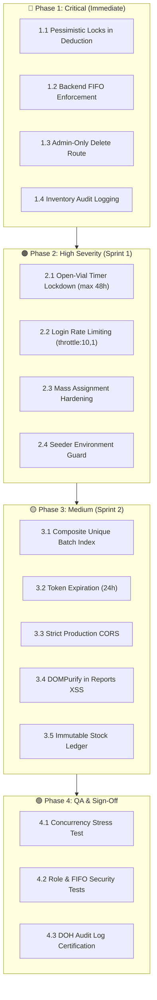

# 📌 Project Tasks & Roadmap — Part 3 (Security & Risk Remediation)

> **System**: Animal Bite Management System (ABTC / RHU)  
> **Module**: Vaccine Inventory, Cold-Chain Safety, Authentication & System Hardening  
> **Standards Compliance**: DOH National Rabies Prevention and Control Program (NRPCP), WHO Vaccine Management Guidelines, FDA MDDS Data Integrity  
> **Date**: September 2026  
> **Source Audit**: [`SECURITY_AUDIT_REPORT.md`](file:///c:/xampp/htdocs/abc/animal-bite-management-system/SECURITY_AUDIT_REPORT.md) & Verified Code Reality  

---

## 📚 PREREQUISITE BRIEFING & SECURITY DOCUMENTATION (Read First)

> [!IMPORTANT]
> Before implementing changes or executing patches, team leads and developers must review the security audit deliverables:
>
> 1. **Step 0.1 — Review Executive Scope (⏱️ ~10 minutes)**:
>    - 📄 [`SECURITY_AUDIT_SUMMARY.md`](file:///c:/xampp/htdocs/abc/animal-bite-management-system/SECURITY_AUDIT_SUMMARY.md): Executive summary for quick briefing, top priority issues, compliance status (WHO, DOH, FDA MDDS), and immediate action plans.
> 2. **Step 0.2 — Read Technical Implementation Details (⏱️ ~1 hour)**:
>    - 📄 [`SECURITY_FIX_CHECKLIST.md`](file:///c:/xampp/htdocs/abc/animal-bite-management-system/SECURITY_FIX_CHECKLIST.md): Step-by-step implementation guide with complete code snippets, before-and-after diffs, and verification commands for all 14 fixes.
> 3. **Deep-Dive & Architecture References (As Needed)**:
>    - 📄 [`SECURITY_DOCS_README.md`](file:///c:/xampp/htdocs/abc/animal-bite-management-system/SECURITY_DOCS_README.md): Quick reference and reading paths for different roles.
>    - 📄 [`SYSTEM_ARCHITECTURE_VULNERABILITIES.md`](file:///c:/xampp/htdocs/abc/animal-bite-management-system/SYSTEM_ARCHITECTURE_VULNERABILITIES.md): Visual diagrams of system architecture, attack scenario flows, and vulnerability heatmaps.
>    - 📄 [`SECURITY_AUDIT_REPORT.md`](file:///c:/xampp/htdocs/abc/animal-bite-management-system/SECURITY_AUDIT_REPORT.md): Full 45-page comprehensive technical analysis with code evidence and CVSS scoring.
>    - 📄 [`WORK_COMPLETION_SUMMARY.md`](file:///c:/xampp/htdocs/abc/animal-bite-management-system/WORK_COMPLETION_SUMMARY.md): Session completion report and key findings summary.

---

## ⚠️ CRITICAL GUARDRAILS & WHAT NOT TO DO (Avoid Breaking Clinic Operations)

> [!CAUTION]
> **1. NEVER Break Automated Form 3 Dose Administration**:
> - When adding transactions and locks to [`VaccineInventoryUsageService.php`](file:///c:/xampp/htdocs/abc/animal-bite-management-system/backend/app/Services/VaccineInventoryUsageService.php), **DO NOT** alter the return contract array (`['batch', 'units_deducted', 'dose_index', 'total_doses', 'is_shared']`).
> - Breaking this breaks [`VaccinationRecordController::store`](file:///c:/xampp/htdocs/abc/animal-bite-management-system/backend/app/Http/Controllers/VaccinationRecordController.php#L345) and halts patient treatment at the nurse desk.

> [!WARNING]
> **2. NEVER Block Emergency Clinical Stock Overrides Without Admin Escalation**:
> - If an open vial has a damaged stopper or cold-chain failure, nurses must not be completely deadlocked if FIFO requires an unusable batch.
> - While FIFO must be strictly enforced by default, emergency overrides must either be reserved for `admin` role or log a high-severity alert in `audit_logs` rather than completely crashing the UI during an active bite emergency.

> [!WARNING]
> **3. NEVER Hard-Delete Inventory Records Without Audit Archiving**:
> - Physical vaccine batches have physical stock cards required by DOH inspectors.
> - Deleting a batch with `VaccineInventory::delete()` erases the forensic ledger. Deletion must strictly be restricted to `admin` and `developer`, and must log before-and-after snapshots to `audit_logs`.

> [!IMPORTANT]
> **4. NEVER Lock Tables Globally or Introduce Deadlocks**:
> - Use row-level pessimistic locking (`->lockForUpdate()`) strictly inside short, atomic `DB::transaction()` closures.
> - Do not perform external HTTP requests or heavy reporting computations inside the inventory transaction lock.

---

## 📊 Summary of Risk Matrix

| Phase | Focus Area | Items | Severity | Target Resolution |
|---|---|---|---|---|
| **Phase 1** | **Critical Concurrency & Integrity Hardening** | 4 Tasks | 🔴 CRITICAL | Immediate (Day 1) |
| **Phase 2** | **Cold-Chain Safety & Access Controls** | 4 Tasks | 🟠 HIGH | Sprint 1 (Days 2–3) |
| **Phase 3** | **Data Architecture & Defense-in-Depth** | 5 Tasks | 🟡 MEDIUM | Sprint 2 (Days 4–7) |
| **Phase 4** | **Automated Verification & Compliance Testing** | 4 Tasks | 🟢 QA / DOH | Sprint 2 (Continuous) |

---

## 🎯 Phased Risk Remediation Plan

---

### 🔴 PHASE 1: Critical Inventory Concurrency & Data Integrity (Immediate Priority)

* **Goal**: Prevent inventory count corruption, eliminate race conditions under concurrent nurse submissions, enforce DOH FIFO/FEFO compliance, lock down destructive actions, and establish mandatory audit logging.

#### 1.1 Fix Race Conditions in Vaccine Inventory Deduction (`VaccineInventoryUsageService.php`)
> 🔍 **Fix Reference**: [`SECURITY_FIX_CHECKLIST.md` §1 (Fix Race Condition in Vaccine Deduction)](file:///c:/xampp/htdocs/abc/animal-bite-management-system/SECURITY_FIX_CHECKLIST.md#1-fix-race-condition-in-vaccine-deduction)  
> 📄 **Technical Audit**: [`SECURITY_AUDIT_REPORT.md` §1 (CVSS 9.1 Critical)](file:///c:/xampp/htdocs/abc/animal-bite-management-system/SECURITY_AUDIT_REPORT.md#1-race-condition-in-vaccine-inventory-deduction)
- [ ] **Atomic Transactions & Pessimistic Row Locking**:
  - In `administerDoseAutomated()`, wrap open-vial check and batch deduction inside `DB::transaction(function () { ... })`.
  - Add `->lockForUpdate()` on open-vial query (`open_vial_status = 'opened'`) and FIFO stock query (`status = 'active'`).
  - In `deductForTreatment()`, wrap batch lookup and deduction in `DB::transaction()` with `->lockForUpdate()`.
  - In [`VaccineInventoryController::adjustStock()`](file:///c:/xampp/htdocs/abc/animal-bite-management-system/backend/app/Http/Controllers/VaccineInventoryController.php#L576), wrap stock adjustment in `DB::transaction()` with `->lockForUpdate()`.
- [ ] **Non-Negative Guardrail**:
  - Add strict check: `$newQuantity = max(0, $batch->current_quantity - $quantity);` and throw a descriptive `ValidationException` if stock is exhausted before deduction commits.
- [ ] **Files to Modify**:
  - [`backend/app/Services/VaccineInventoryUsageService.php`](file:///c:/xampp/htdocs/abc/animal-bite-management-system/backend/app/Services/VaccineInventoryUsageService.php)
  - [`backend/app/Http/Controllers/VaccineInventoryController.php`](file:///c:/xampp/htdocs/abc/animal-bite-management-system/backend/app/Http/Controllers/VaccineInventoryController.php)

#### 1.2 Backend Enforcement of FIFO / FEFO Stock Usage (`VaccineInventoryUsageService.php` & `VaccineInventoryController.php`)
> 🔍 **Fix Reference**: [`SECURITY_FIX_CHECKLIST.md` §2 (Enforce FIFO on Backend)](file:///c:/xampp/htdocs/abc/animal-bite-management-system/SECURITY_FIX_CHECKLIST.md#2-enforce-fifo-on-backend)  
> 📄 **Technical Audit**: [`SECURITY_AUDIT_REPORT.md` §2 (CVSS 8.5 Critical)](file:///c:/xampp/htdocs/abc/animal-bite-management-system/SECURITY_AUDIT_REPORT.md#2-fifo-bypass---backend-doesnt-enforce-fifo)
- [ ] **Validate Priority Batch on Direct Usage**:
  - When `POST /api/inventory/use-vaccine` is called with `force_batch_id`:
    - Query the legitimate FIFO/FEFO priority batch (earliest `expiration_date`, then earliest `created_at`).
    - If `force_batch_id` does not match the FIFO batch:
      - If user is NOT an admin: Reject with `422 Unprocessable Entity` (`"FIFO Violation: Batch #[batch_no] (expires [date]) must be used first to prevent vaccine spoilage."`).
      - If user IS an admin (Emergency Override): Allow with mandatory `AuditLog::log('fifo_override', ...)` recording reason.
- [ ] **Prevent Bypassing via Client Payloads**:
  - Ensure automated Form 3 flow continues to seamlessly pick the correct FIFO batch without manual batch guessing by nurses.
- [ ] **Files to Modify**:
  - [`backend/app/Services/VaccineInventoryUsageService.php`](file:///c:/xampp/htdocs/abc/animal-bite-management-system/backend/app/Services/VaccineInventoryUsageService.php)
  - [`backend/app/Http/Controllers/VaccineInventoryController.php`](file:///c:/xampp/htdocs/abc/animal-bite-management-system/backend/app/Http/Controllers/VaccineInventoryController.php)

#### 1.3 Restrict Inventory Deletion to Admin & Developer (`api.php` & `VaccineInventoryController.php`)
> 🔍 **Fix Reference**: [`SECURITY_FIX_CHECKLIST.md` §3 (Restrict Inventory Deletion to Admin Only)](file:///c:/xampp/htdocs/abc/animal-bite-management-system/SECURITY_FIX_CHECKLIST.md#3-restrict-inventory-deletion-to-admin-only)  
> 📄 **Technical Audit**: [`SECURITY_AUDIT_REPORT.md` §3 (CVSS 8.9 Critical)](file:///c:/xampp/htdocs/abc/animal-bite-management-system/SECURITY_AUDIT_REPORT.md#3-unauthorized-deletion-of-inventory-records)
- [ ] **Route Middleware Lockdown**:
  - Isolate `DELETE /api/inventory/{id}` out of the broad staff group.
  - Apply `middleware('role:admin,developer')` strictly to `destroy()`.
- [ ] **Safe Destruction / Depletion Check**:
  - In `destroy()`, prevent deletion if the inventory item has existing treatment administration records (`treatment_records` count `> 0`).
  - If records exist, return `422` advising the staff to mark the batch as `'depleted'` or `'disposed'` instead of deleting history.
- [ ] **Frontend UI Role Guard**:
  - In [`InventoryTable.tsx`](file:///c:/xampp/htdocs/abc/animal-bite-management-system/frontend/src/features/inventory/components/InventoryTable/InventoryTable.tsx), hide the `Delete` action menu item if the logged-in user is not `admin` or `developer`.
- [ ] **Files to Modify**:
  - [`backend/routes/api.php`](file:///c:/xampp/htdocs/abc/animal-bite-management-system/backend/routes/api.php#L315)
  - [`backend/app/Http/Controllers/VaccineInventoryController.php`](file:///c:/xampp/htdocs/abc/animal-bite-management-system/backend/app/Http/Controllers/VaccineInventoryController.php#L562)
  - [`frontend/src/features/inventory/components/InventoryTable/InventoryTable.tsx`](file:///c:/xampp/htdocs/abc/animal-bite-management-system/frontend/src/features/inventory/components/InventoryTable/InventoryTable.tsx)

#### 1.4 Comprehensive Audit Trail for Inventory Operations (`VaccineInventoryController.php`)
> 🔍 **Fix Reference**: [`SECURITY_FIX_CHECKLIST.md` §4 (Add Audit Logging for All Operations)](file:///c:/xampp/htdocs/abc/animal-bite-management-system/SECURITY_FIX_CHECKLIST.md#4-add-audit-logging-for-all-operations)  
> 📄 **Technical Audit**: [`SECURITY_AUDIT_REPORT.md` §4 (CVSS 8.2 Critical)](file:///c:/xampp/htdocs/abc/animal-bite-management-system/SECURITY_AUDIT_REPORT.md#4-no-audit-logging-for-inventory-operations)
- [ ] **Integrate `AuditLog::log()`**:
  - **Batch Creation (`store`)**: Log action `inventory_created` with new batch metadata, quantity, and user ID.
  - **Batch Update (`update`)**: Log action `inventory_updated` with `old_values` and `new_values`.
  - **Stock Adjustment (`adjustStock`)**: Log action `inventory_stock_adjusted` with adjustment type (`received`, `adjusted`, `expired`, `disposed`), quantity delta, and remarks.
  - **Open-Vial Actions (`openVial`, `discardVial`)**: Log action `vial_opened` and `vial_discarded`.
  - **Batch Deletion (`destroy`)**: Log action `inventory_deleted` with full snapshot of the deleted batch before deletion.
- [ ] **Files to Modify**:
  - [`backend/app/Http/Controllers/VaccineInventoryController.php`](file:///c:/xampp/htdocs/abc/animal-bite-management-system/backend/app/Http/Controllers/VaccineInventoryController.php)

---

### 🟠 PHASE 2: Cold-Chain Safety & Access Controls (Sprint 1)

* **Goal**: Enforce strict WHO/DOH open-vial cold-chain safety limits, defend authentication endpoints from brute force, and secure data models.

#### 2.1 Open-Vial Discard Timer Lockdown (`VaccineInventoryController.php` & `VaccineInventoryUsageService.php`)
> 🔍 **Fix Reference**: [`SECURITY_FIX_CHECKLIST.md` §5 (Validate Open Vial Hours)](file:///c:/xampp/htdocs/abc/animal-bite-management-system/SECURITY_FIX_CHECKLIST.md#5-validate-open-vial-hours)  
> 📄 **Technical Audit**: [`SECURITY_AUDIT_REPORT.md` §5 (CVSS 7.4 High)](file:///c:/xampp/htdocs/abc/animal-bite-management-system/SECURITY_AUDIT_REPORT.md#5-open-vial-timer-manipulation)
- [ ] **Strict Input Validation on Open-Vial Hours**:
  - In `openVial()`, validate `$request->validate(['open_vial_hours' => 'nullable|integer|min:1|max:48'])`.
  - In `store()` and `update()`, reduce allowed `open_vial_hours` from `max:168` (7 days) down to `max:48` (standard reconstituted rabies vaccine must be used within 6–8 hours; rabies immunoglobulin within 24–48 hours).
- [ ] **Automated Expiry & Discard State**:
  - When `administerDoseAutomated()` checks for open vials, ensure vials where `open_vial_discard_at <= now()` are automatically transitioned to `open_vial_status = 'unopened'` and discarded with an audit log note, prompting a fresh vial opening.
- [ ] **Files to Modify**:
  - [`backend/app/Http/Controllers/VaccineInventoryController.php`](file:///c:/xampp/htdocs/abc/animal-bite-management-system/backend/app/Http/Controllers/VaccineInventoryController.php#L393)
  - [`backend/app/Services/VaccineInventoryUsageService.php`](file:///c:/xampp/htdocs/abc/animal-bite-management-system/backend/app/Services/VaccineInventoryUsageService.php#L23)

#### 2.2 Brute-Force Rate Limiting on Authentication (`api.php` & `AuthController.php`)
> 🔍 **Fix Reference**: [`SECURITY_FIX_CHECKLIST.md` §8 (Add Rate Limiting on Login)](file:///c:/xampp/htdocs/abc/animal-bite-management-system/SECURITY_FIX_CHECKLIST.md#8-add-rate-limiting-on-login)  
> 📄 **Technical Audit**: [`SECURITY_AUDIT_REPORT.md` §8 (CVSS 7.5 High)](file:///c:/xampp/htdocs/abc/animal-bite-management-system/SECURITY_AUDIT_REPORT.md#8-no-rate-limiting-on-login)
- [ ] **Apply Throttling Middleware**:
  - Add `->middleware('throttle:10,1')` (10 requests per minute) to `POST /api/login`.
  - Add `->middleware('throttle:5,1')` to `POST /api/register`.
- [ ] **Failed Login Audit Logging**:
  - In `AuthController::login()`, log failed login attempts (`AuditLog::log('login_failed', ...)`) with IP address and attempted email.
- [ ] **Files to Modify**:
  - [`backend/routes/api.php`](file:///c:/xampp/htdocs/abc/animal-bite-management-system/backend/routes/api.php#L42)
  - [`backend/app/Http/Controllers/AuthController.php`](file:///c:/xampp/htdocs/abc/animal-bite-management-system/backend/app/Http/Controllers/AuthController.php)

#### 2.3 Mass Assignment Hardening (`VaccineInventory.php`)
> 🔍 **Fix Reference**: [`SECURITY_FIX_CHECKLIST.md` §6 (Protect Against Mass Assignment)](file:///c:/xampp/htdocs/abc/animal-bite-management-system/SECURITY_FIX_CHECKLIST.md#6-protect-against-mass-assignment)  
> 📄 **Technical Audit**: [`SECURITY_AUDIT_REPORT.md` §6 (CVSS 7.2 High)](file:///c:/xampp/htdocs/abc/animal-bite-management-system/SECURITY_AUDIT_REPORT.md#6-mass-assignment-in-vaccineinventory)
- [ ] **Protect Multi-Tenant Key**:
  - Remove `'clinic_id'` from `$fillable` or switch to `$guarded = ['inventory_id']` while ensuring controller assigns `$inventory->clinic_id = $request->user()->clinic_id` explicitly.
  - Prevent cross-tenant batch tampering.
- [ ] **Files to Modify**:
  - [`backend/app/Models/VaccineInventory.php`](file:///c:/xampp/htdocs/abc/animal-bite-management-system/backend/app/Models/VaccineInventory.php#L15)

#### 2.4 Production Seeder Security Hardening (`DefaultClinicSeeder.php`)
> 🔍 **Fix Reference**: [`SECURITY_FIX_CHECKLIST.md` §7 (Secure Default Passwords)](file:///c:/xampp/htdocs/abc/animal-bite-management-system/SECURITY_FIX_CHECKLIST.md#7-secure-default-passwords)  
> 📄 **Technical Audit**: [`SECURITY_AUDIT_REPORT.md` §7 (CVSS 7.8 High)](file:///c:/xampp/htdocs/abc/animal-bite-management-system/SECURITY_AUDIT_REPORT.md#7-weak-default-passwords-in-seeders)
- [ ] **Environment Check for Default Passwords**:
  - In `DefaultClinicSeeder.php`, check `app()->environment('production')`.
  - If in production, generate cryptographically secure random passwords or require interactive console prompts rather than defaulting to `password123`.
- [ ] **Files to Modify**:
  - [`backend/database/seeders/DefaultClinicSeeder.php`](file:///c:/xampp/htdocs/abc/animal-bite-management-system/backend/database/seeders/DefaultClinicSeeder.php)

---

### 🟡 PHASE 3: Data Integrity & Architectural Defense-in-Depth (Sprint 2)

* **Goal**: Guarantee database constraint enforcement, token lifecycle governance, XSS mitigation, and CORS isolation.

#### 3.1 Unique Batch Constraint per Clinic (Database Migration)
> 🔍 **Fix Reference**: [`SECURITY_FIX_CHECKLIST.md` §14 (Add Unique Constraint on Batch Numbers)](file:///c:/xampp/htdocs/abc/animal-bite-management-system/SECURITY_FIX_CHECKLIST.md#14-add-unique-constraint-on-batch-numbers)  
> 📄 **Technical Audit**: [`SECURITY_AUDIT_REPORT.md` §14 (CVSS 5.3 Medium)](file:///c:/xampp/htdocs/abc/animal-bite-management-system/SECURITY_AUDIT_REPORT.md#14-missing-database-constraints)
- [ ] **Add Composite Unique Index**:
  - Create migration: `add_unique_batch_per_clinic_to_vaccine_inventory_table`.
  - Add unique constraint: `$table->unique(['clinic_id', 'batch_number', 'vaccine_type'], 'unique_clinic_vaccine_batch');` (excluding soft-deleted/depleted if applicable or unique on active).
  - Handle controller validation for `batch_number` unique check with friendly error message: `"A batch with this number already exists for this vaccine in your clinic."`
- [ ] **Files to Modify**:
  - `backend/database/migrations/YYYY_MM_DD_add_unique_batch_per_clinic.php`
  - [`backend/app/Http/Controllers/VaccineInventoryController.php`](file:///c:/xampp/htdocs/abc/animal-bite-management-system/backend/app/Http/Controllers/VaccineInventoryController.php#L460)

#### 3.2 Token Expiration Configuration (`sanctum.php`)
> 🔍 **Fix Reference**: [`SECURITY_FIX_CHECKLIST.md` §13 (Configure Token Expiration)](file:///c:/xampp/htdocs/abc/animal-bite-management-system/SECURITY_FIX_CHECKLIST.md#13-configure-token-expiration)  
> 📄 **Technical Audit**: [`SECURITY_AUDIT_REPORT.md` §13 (CVSS 6.5 Medium)](file:///c:/xampp/htdocs/abc/animal-bite-management-system/SECURITY_AUDIT_REPORT.md#13-tokens-never-expire)
- [ ] **Configure Personal Access Token Expiration**:
  - In `config/sanctum.php`, change `'expiration' => null` to `'expiration' => env('SANCTUM_TOKEN_EXPIRATION', 1440)` (24 hours for clinic workstation security).
  - Add token refresh handling in frontend axios interceptors if session expired.
- [ ] **Files to Modify**:
  - [`backend/config/sanctum.php`](file:///c:/xampp/htdocs/abc/animal-bite-management-system/backend/config/sanctum.php#L50)
  - `backend/.env.example`

#### 3.3 Strict CORS Configuration (`cors.php`)
> 🔍 **Fix Reference**: [`SECURITY_FIX_CHECKLIST.md` §11 (Restrict CORS in Production)](file:///c:/xampp/htdocs/abc/animal-bite-management-system/SECURITY_FIX_CHECKLIST.md#11-restrict-cors-in-production)  
> 📄 **Technical Audit**: [`SECURITY_AUDIT_REPORT.md` §11 (CVSS 5.3 Medium)](file:///c:/xampp/htdocs/abc/animal-bite-management-system/SECURITY_AUDIT_REPORT.md#11-cors-configuration-too-permissive)
- [ ] **Constrain Localhost Wildcards for Production**:
  - In `config/cors.php`, ensure `allowed_origins_patterns` with regex `(:\\d+)?` is active only in local/testing environments.
  - In production, restrict strictly to configured `FRONTEND_URL`.
- [ ] **Files to Modify**:
  - [`backend/config/cors.php`](file:///c:/xampp/htdocs/abc/animal-bite-management-system/backend/config/cors.php#L29)

#### 3.4 Sanitize Reports HTML Rendering (`ReportsDashboardPage.tsx`)
> 🔍 **Fix Reference**: [`SECURITY_FIX_CHECKLIST.md` §12 (Sanitize HTML in Reports)](file:///c:/xampp/htdocs/abc/animal-bite-management-system/SECURITY_FIX_CHECKLIST.md#12-sanitize-html-in-reports)  
> 📄 **Technical Audit**: [`SECURITY_AUDIT_REPORT.md` §12 (CVSS 6.1 Medium)](file:///c:/xampp/htdocs/abc/animal-bite-management-system/SECURITY_AUDIT_REPORT.md#12-stored-xss-in-patient-reports)
- [ ] **DOMPurify Integration**:
  - In `ReportsDashboardPage.tsx` line 229:
    Replace `
` with sanitized output using `DOMPurify.sanitize(html)` or iframe sandboxing.
  - Prevent stored XSS in clinic report templates.
- [ ] **Files to Modify**:
  - [`frontend/src/features/reports/pages/ReportsDashboardPage.tsx`](file:///c:/xampp/htdocs/abc/animal-bite-management-system/frontend/src/features/reports/pages/ReportsDashboardPage.tsx#L229)

#### 3.5 Immutable Stock Ledger Integrity
> 🔍 **Fix Reference**: [`SECURITY_FIX_CHECKLIST.md` §9 (Prevent Transaction Backdating)](file:///c:/xampp/htdocs/abc/animal-bite-management-system/SECURITY_FIX_CHECKLIST.md#9-prevent-transaction-backdating)  
> 📄 **Technical Audit**: [`SECURITY_AUDIT_REPORT.md` §9 (CVSS 6.8 Medium)](file:///c:/xampp/htdocs/abc/animal-bite-management-system/SECURITY_AUDIT_REPORT.md#9-fraudulent-transaction-creation)
- [ ] **Enforce Auto-Date & Non-Editable Transactions**:
  - Ensure `inventory_transactions` cannot be edited or deleted once written.
  - Make `transaction_date` consistently default to `now()`.
- [ ] **Files to Modify**:
  - [`backend/app/Models/InventoryTransaction.php`](file:///c:/xampp/htdocs/abc/animal-bite-management-system/backend/app/Models/InventoryTransaction.php)

---

### 🟢 PHASE 4: Automated Verification & Compliance Testing (QA & Sign-Off)

* **Goal**: Rigorous verification through stress testing, penetration tests, and compliance validation.

#### 4.1 Concurrency & Stress Testing (ApacheBench / Pest Test)
- [ ] **Concurrent Stock Depletion Test**:
  - Execute 20 concurrent requests attempting to decrement a batch with only 5 units remaining.
  - Verify exactly 5 requests succeed, 15 receive stock exhaustion errors, and `current_quantity` remains exactly `0` (never negative).
- [ ] **Concurrent Open-Vial Dose Test**:
  - Execute concurrent requests against an open vial with 1 dose remaining.
  - Verify exactly 1 request receives the remaining dose, the vial marks complete, and the second request safely opens a fresh vial from FIFO stock.

#### 4.2 Security & Role-Based Access Control Verification
- [ ] **Unauthorized Deletion Test**:
  - Authenticate as nurse (`role = 'nurse'`) and issue `DELETE /api/inventory/{id}`.
  - Verify response is strictly `403 Forbidden`.
- [ ] **FIFO Violation Test**:
  - Issue `POST /api/inventory/use-vaccine` with a non-FIFO `force_batch_id`.
  - Verify response is strictly `422 Unprocessable Entity` with FIFO violation details.
- [ ] **Login Rate Limiter Test**:
  - Send 12 consecutive failed login requests within 10 seconds.
  - Verify 11th and 12th requests return `429 Too Many Requests`.

#### 4.3 DOH Audit Log Verification
- [ ] **Verify Audit Trail Output**:
  - Perform inventory add, update, adjust, and admin-delete actions.
  - Verify all actions appear in `GET /api/audit-logs` with correct user ID, IP address, timestamps, and before/after payloads.

---

## 📅 Recommended Execution Order

